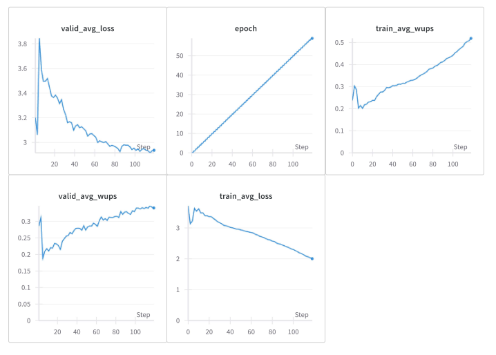
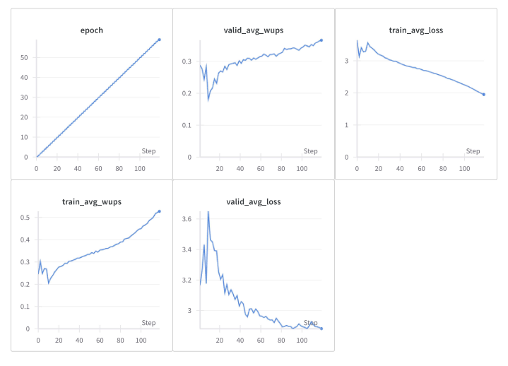

# Visual Question Answering 

* ##  Introduction 

Visual Question Answering (VQA) has emerged as a significant research area at the intersection of computer vision and natural language processing. 

The choice of the dataset is DAQUAR which consists of 12.5k question-answer pairs. There are about 9 question-answer pairs per image, mainly composed of indoor scenarios. Answers can be categorized into objects, colors, and numbers. The choice of evaluation metric is the WUPS score as it does not impose stringent measurement and is designed to handle ambiguous answers. The objective of this work is to compare and analyze the performance of Convolutional Neural Networks and Vision Transformers. 

* ##  Data Cleaning

The original dataset consists of 584 uniques answers, however these answers contain ambigious representation of the same object. Furthermore, there are a lot of answers whose occurance count is less than 5 in the entire dataset. 

In order to stabilize the dataset, I have removed answers with less than 5 occurances and its respective <Question, Image> pair. 

The resultant is unique answer space of length 170. 

* ##  Methodology

The choice of text encoder is the T5-base Language Model, the encoder module is used to process the input question text. The choice of Vision Component can be either a Vision Transformer or a Convolution Neural Network Model. The final layer is a answer predictor which classifies the given input pair <Question, Image> 
to its corresponding answer. 

The answer predictor classifies the highest or topk softmax scores across all the unique answers in the dataset. 

Based on this, I have proposed two multi-modal architecture. 

* Vision Transformer + T5-base Encoder & Decoder. 

In this multi-modal pipeline, the T5-encoder module is used to obtain the hidden state representation of the input question text while the ViT model is convert the image into hidden state representation. 

The pooled image embeddings and the [QUESTION] token embeddings are concatenated as input to the decoder module of T5-base.

* CNN (VGG16, Resnet34, Resnet50) + T5-base Encoder & SGA Modules.

In this multi-modal pipeline, the T5-encoder module is used to obtain the hidden state representation of the input question text while the CNN backbone network encodes the image into feature representation. The output of CNN is a tensor of size [batch, n_channels, h, w]. 

For, VGG-16, Resnet34 - the output channels are 512, thus a upscaling layer is used to increase the number of channels to 768

For, Resnet50 - the output channels are 2048, thus a downscaling layer is used to decrease the number of channels to 768.

The role of the scaling layer is to ensure that feature dimension of text embeddings and vision embeddings are the same to faciliate concatenation. 

### SGA Modules

Self-guided attention operates within the same input sequence or modality. It calculates attention weights based solely on information contained within the sequence itself. It focuses on capturing local relationships or dependencies within the sequence. Each element attends to other elements within the same sequence, allowing for the modeling of relationships between nearby elements. 

The VQA pipeline in this case implements a SGA Module List of Size 3, with the above visualized architecture. The text embeddings from T5-base are computed using a Multi-head Attention, the resultant is combined with the image features and attention is computed jointly. The output representation 
is passed to a feedforward neural network. Layer Normalization and Dropout is added after every layer within a SGA module. 

* ##  Methodology

Training Hyperparameters 

    Epochs : 60
    Batch Size : 4 
    Optimizer : AdamW 
    lr adapter : Linear LR Scheduler with warmup 

Training Results 

Final Test WUPS : 0.3468

Final Test WUPS : 0.4191

Final Test WUPS : 0.3663

Final Test WUPS : 0.3501
